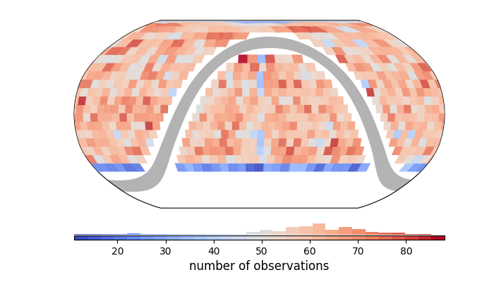

========================
ztffields documentation
========================

ztffields_ is a package made to handle Zwicky Transient Facility (ZTF)
fields system.

ZTF observes using pre-define sets of field idenfitied
with a unique `fieldid` ; it already exists more than 2000.

The ZTF camera is made of 16 CCDs identified by a unique `ccdid`
ranging from 1 to 16 (incl.) and each CCD has four amplifier,
definining 4 quadrants defining, in total 64 rcid (16x4) ranging from
0 to 63 (incl.).

ztffields_ enables to interact with the ztf field system at the
focalplane (whole camera footprint ; 1 polygon), at the ccd (16 polygons) or at the
quadrant (64 polygons) levels.

Sharp start
============

**Get the fieldid that contains a given set of targets**

get the fields containing one target

.. code-block:: python

	import ztffields
	ztffields.radec_to_fieldid( [80, -20] ) # returns a pandas.Series

.. parsed-literal::
   
	# result
	index_radec
	0    1297
	0     305
	Name: fieldid, dtype: int64

or for a list of targets.

.. code-block:: python
		
	import numpy as np
	random = np.random.default_rng(12345)
	ras = random.uniform(size=100, low=0, high=360)
	decs = random.uniform(size=100, low=0, high=360)
	radecs = np.vstack([ras,decs]).T
	# input shape (N, 2) or pandas.DataFrame()
	fields = ztffields.radec_to_fieldid(radecs) # returns a pandas.Series
	fields.head(5)
	
.. parsed-literal::
   
	 index_radec
	 0    1815
	 0     812
	 1    1894
	 1     871
	 1     872
	 Name: fieldid, dtype: int64

The index of `fields` is that of the input coordinates. This matching
is lightning fast. Try !

**Select fields for some conditions**
The `ztffields.get_fieldid` function has options to select fields
given some basic conditions such as, grid system (main/secondary)
galactic latitude or milky way extensions. See details in the
function's docstring. For instance, let's consider the fields or the
main grid avoiding galactic latitude lower than 10.

.. code-block:: python
		
    good_fields = ztffields.get_fieldid(galb_range=[[-90,-10], [10,90]], grid="main")

    
**Now display the number of target per main grid fields**

.. code-block:: python

    # Let's generate random sky distribution

    size = 40_000
    dec_range = [-45, 90]
    ra_range=[0,360]

    # -> random in the sky
    dec_sin_range = np.sin(np.asarray(dec_range)*np.pi/180)
    ra = random.uniform(*ra_range, size=size)
    dec = np.arcsin( random.uniform(*dec_sin_range, size=size) ) / (np.pi/180)

    # build a dataframe structure.
    radecs = pandas.DataFrame({"ra":ra, "dec":dec})

    # and project to a focalplane shape | try using ccd or quadrant
    df = ztffields.radec_to_fieldid(radecs, level="focalplane")

    # groupby field id
    fieldid_s = df.to_frame().groupby("fieldid").size()

    # - and limit to main grid not in the MW
    good_fields = ztffields.get_fieldid(galb_range=[[-90,-10],[10,90]], grid="main")
    fieldid_s = fieldid_s[fieldid_s.index.isin(good_fields)]

    # Display | change the origin to shift the milky way
    fig = ztffields.skyplot_fields(fieldid_s, origin=180) # change the
    
.. image:: _static/skyplot_random.png
  :alt: Skyplot random

**Tweack how to display**

.. code-block:: python

    # change the origin of the milky way,
    # change the projection direction specifying 'geo' in the system (instead of astro by default)
    # add a label
    # change the colormap
    # using a cartopy projection
    import cartopy.crs as ccrs
    fig = ztffields.skyplot_fields(fieldid_s, 
                                   origin=0,
                               system="geo icrs", 
                               label="number of observations",
                               cmap="coolwarm",
                   projection=ccrs.Robinson())

		   

Documentation
===============
	
.. toctree::
   :caption: Code documentation
   :titlesonly:

   ztffields
   ztffields.projection
   ztffields.fields
   ztffields.utils   
   modules

Indices and tables
==================

* :ref:`genindex`
* :ref:`modindex`
* :ref:`search`

.. _ztffields: https://ztffields.readthedocs.io/en/latest/index.html  
