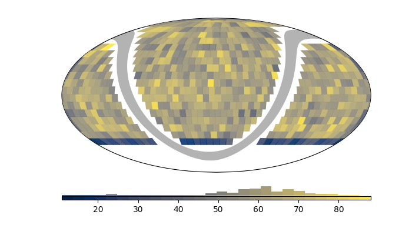

========================
ztffields documentation
========================

ztffields_ is a package made to handle Zwicky Transient Facility (ZTF)
fields system.

ZTF observes using pre-define sets of field idenfitied
with a unique `fieldid` ; it already exists more than 2000 fieldids.

The ZTF camera is made of 16 CCDs identified by a unique `ccdid`
ranging from 1 to 16 (incl.) and each CCD has four amplifier,
definining 4 quadrants defining, in total 64 rcid (16x4) ranging from
0 to 63 (incl.).

ztffields_ enables to interact with the ztf field system at the
focalplane (whole camera footprint ; 1 polygon), at the ccd (16 polygons) or are the
quadrant (64 polygons) levels.

Sharp start
============

**Get the fieldid and quadrant rcid that contains a given set of targets**

.. code-block:: python

	import pandas
	import numpy as np
	import ztffields
	
	np.random.seed(1234) # seed
	
	# generate 4000 RA, Dec coordinates with some bounds
	size = 40_000
	dec_range = [-45, 90]
	ra_range=[0,360]
	
	# -> random in the sky
	dec_sin_range = np.sin(np.asarray(dec_range)*np.pi/180)
	ra = np.random.uniform(*ra_range, size=size)
	dec = np.arcsin( np.random.uniform(*dec_sin_range, size=size) ) / (np.pi/180)

	# build a dataframe structure.
	radecs = pandas.DataFrame({"ra":ra, "dec":dec})

	# and project to a focalplane shape | try using ccd or quadrant
	df = ztffields.radec_to_fieldid(radecs, level="focalplane")
	df.loc[600] # see the fieldid containing the target 600

.. parsed-literal::
   
	# result
	index_radec
	600    1729
	600     688
	Name: fieldid, dtype: object

	
Matching 4000 targets takes: 300ms (focalplane level), ~1s (ccd-level)
or ~4s (quadrant level)

**Now display the number of target per main grid fields**

.. code-block:: python

	# groupby field id
	fieldid_s = df.to_frame().groupby("fieldid").size()

	# - and limit to the main grid
	fieldid_s = fieldid_s[fieldid_s.index<1000]

	# Display
	fig = ztffields.skyplot_fields(fieldid_s)

Documentation
===============
	
.. toctree::
   :caption: Code documentation
   :titlesonly:

   ztffields
   ztffields.projection
   ztffields.fields
   ztffields.utils   
   modules

Indices and tables
==================

* :ref:`genindex`
* :ref:`modindex`
* :ref:`search`

.. _ztffields: https://ztffields.readthedocs.io/en/latest/index.html  
